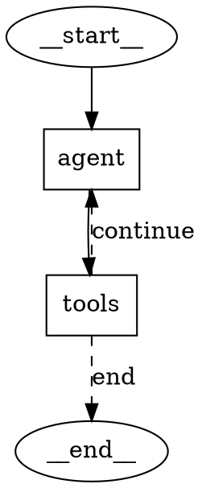

# 图可视化

Synaptic 提供了多种方式来可视化已编译的图，从适合终端和文档的纯文本格式，到适合演示和调试的图片格式。

## Mermaid 图表

生成 [Mermaid](https://mermaid.js.org/) 流程图字符串。非常适合嵌入到 Markdown 文档和 GitHub README 中：

```rust
let mermaid = graph.draw_mermaid();
println!("{mermaid}");
```

输出示例：

```
graph TD
    __start__(["__start__"])
    agent["agent"]
    tools["tools"]
    __end__(["__end__"])
    __start__ --> agent
    agent --> tools
    tools -.-> |continue| agent
    tools -.-> |end| __end__
```

- `__start__` 和 `__end__` 渲染为圆角节点。
- 用户定义的节点渲染为矩形。
- 固定边使用实线箭头（`-->`）。
- 带路径映射的条件边使用虚线箭头（`-.->`）并附带标签。

## ASCII 艺术图

生成适合终端输出的简单文本摘要：

```rust
let ascii = graph.draw_ascii();
println!("{ascii}");
```

输出示例：

```
Graph:
  Nodes: agent, tools
  Entry: __start__ -> agent
  Edges:
    agent -> tools
    tools -> __end__ | agent  [conditional]
```

`Display` trait 也已实现，因此可以直接使用 `println!("{graph}")`，输出的是 ASCII 表示。

## DOT 格式（Graphviz）

生成 [Graphviz DOT](https://graphviz.org/) 字符串，可配合 `dot` 命令行工具使用：

```rust
let dot = graph.draw_dot();
println!("{dot}");
```

输出示例：



## 通过 Graphviz 生成 PNG

使用 Graphviz 的 `dot` 命令将图渲染为 PNG 图片。需要 `dot` 已安装并在 `$PATH` 中可用：

```rust
graph.draw_png("my_graph.png")?;
```

底层实现是将 DOT 输出通过管道传给 `dot -Tpng`，并将生成的图片写入指定路径。

## 通过 Mermaid.ink API 生成 PNG

使用 [mermaid.ink](https://mermaid.ink/) 网络服务将图渲染为 PNG 图片。需要互联网访问，但不需要任何本地工具：

```rust
graph.draw_mermaid_png("graph_mermaid.png").await?;
```

Mermaid 文本经过 base64 编码后发送到 `https://mermaid.ink/img/{encoded}`，返回的图片保存到指定路径。

## 通过 Mermaid.ink API 生成 SVG

类似地，也可以生成 SVG 格式：

```rust
graph.draw_mermaid_svg("graph_mermaid.svg").await?;
```

## 总结

| 方法 | 格式 | 依赖条件 |
|------|------|----------|
| `draw_mermaid()` | Mermaid 文本 | 无 |
| `draw_ascii()` | 纯文本 | 无 |
| `draw_dot()` | DOT 文本 | 无 |
| `draw_png(path)` | PNG 图片 | PATH 中需要 Graphviz `dot` |
| `draw_mermaid_png(path)` | PNG 图片 | 需要互联网访问 |
| `draw_mermaid_svg(path)` | SVG 图片 | 需要互联网访问 |
| `Display` trait | 纯文本 | 无 |

## 使用提示

- 使用 `draw_mermaid()` 生成可在 GitHub 或 mdBook 上渲染的文档。
- 使用 `draw_ascii()` 或 `Display` 在终端中进行快速调试。
- 没有 `path_map` 的条件边无法在可视化中显示其目标。如果需要完整的可视化支持，请使用 `add_conditional_edges_with_path_map()` 代替 `add_conditional_edges()`。
